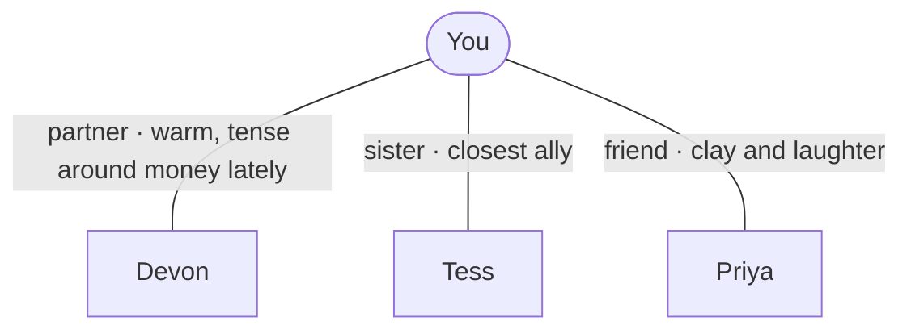

# Your world

- **Devon** — partner, six years. Warm; the money conversations go tense. → [Devon](people/Devon.md)
- **Tess** — younger sister, the one the jury goes quiet around. → [Tess](people/Tess.md)
- **Priya** — friend from the pottery class; easy company. → [Priya](people/Priya.md)
