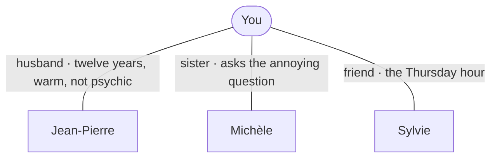

# Your world

- **Jean-Pierre** — husband, twelve years. Warm, literal, waits to be told. → [Jean-Pierre](people/Jean-Pierre.md)
- **Michèle** — older sister; the one who asks "and did you tell him?" → [Michèle](people/Michèle.md)
- **Sylvie** — friend from the studio; the Thursday drawing hour. → [Sylvie](people/Sylvie.md)
