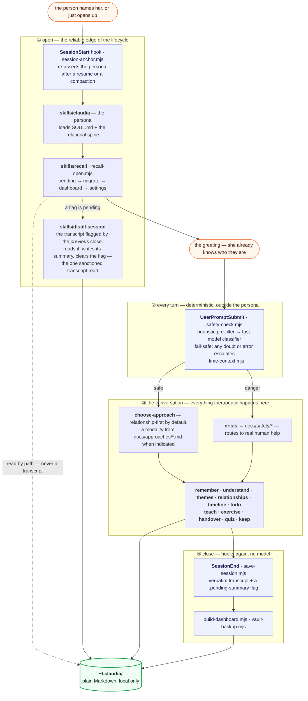
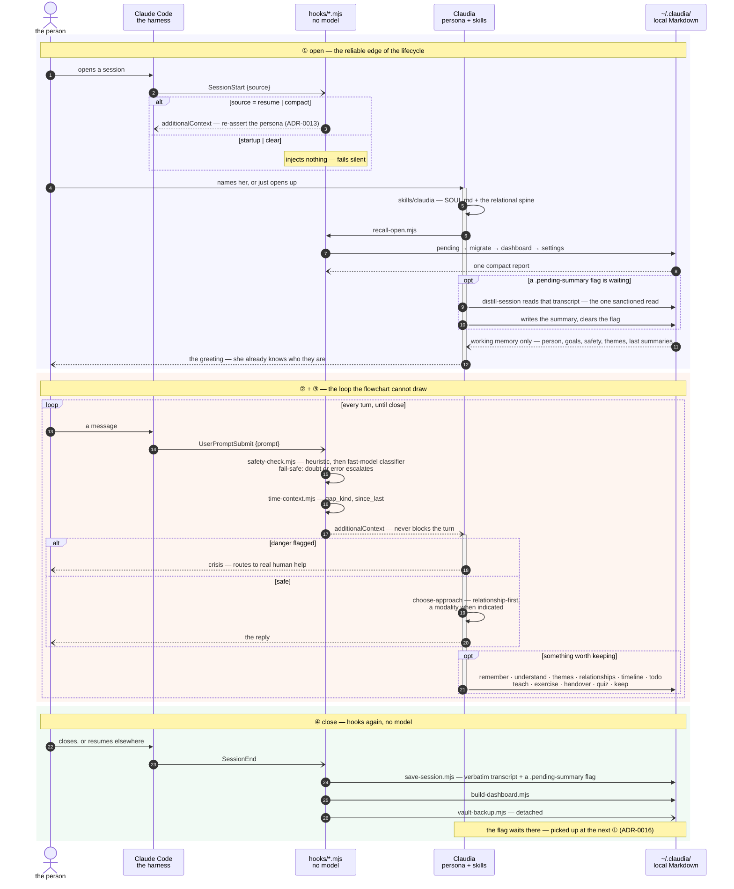

# Architecture

How Claudia is put together, and why. This is the durable overview; the binding
decisions live as ADRs in [`docs/adr/`](../plugin/docs/adr/), the vocabulary in
[`CONTEXT.md`](../plugin/CONTEXT.md).

## The shape in one picture

One session, top to bottom. The hooks are deterministic and run without the model;
everything between them is the conversation, and every path ends in the person's
own Markdown.



Two edges are deliberately **not** drawn, because a cycle would flip the stages out
of reading order: `③ → ②` (the next turn re-enters the safety hook) and
`④ → ①` (the `.pending-summary` flag left at close is picked up at the _next_
session's open — [ADR-0016](../plugin/docs/adr/0016-deferred-distillation.md)). Both live in the
node labels instead — the event view below draws them. The memory loop they form
is the subject of [ADR-0004](../plugin/docs/adr/0004-memory-model.md).

## The same session, as events

The picture above is the map: who calls what. This is the tape: what fires, in
what order, on whose lane. Same session, same four stages — but a lifeline can
loop and come back, so the two edges the map had to leave in the labels are drawn
here.



Three things the lanes make plain that the map does not. `Claude Code` carries
lifecycle events only — the conversation never routes through a hook. `hooks/*.mjs`
runs at both edges and once per turn, always without the model, and its per-turn
output is context, never a veto. And every arrow that ends anywhere ends in
`~/.claudia/` — including the last one, which the _next_ open reads back.

## The five load-bearing decisions

1. **Safety floor beneath immersion** — [ADR-0001](../plugin/docs/adr/0001-safety-floor.md).
   Immersion-first, but a small set of never/always rules is non-negotiable and
   enforced by substance + the crisis pivot, not by repeated disclaimers.
2. **Relationship-first core, modalities on demand** —
   [ADR-0002](../plugin/docs/adr/0002-knowledge-architecture.md). The relational spine is always
   loaded; the 12+ approaches are a just-in-time library; an approach may lead
   when a specific technique is indicated (e.g. exposure for anxiety/OCD/PTSD).
3. **Claude Code plugin runtime shape** —
   [ADR-0003](../plugin/docs/adr/0003-plugin-runtime-shape.md). Persona is a skill (a plugin's
   `CLAUDE.md` is not auto-loaded); natural-language-first with only four
   commands; per-turn safety is a deterministic hook; single-plugin marketplace.
4. **Two-layer memory under `~/.claudia/`** —
   [ADR-0004](../plugin/docs/adr/0004-memory-model.md). Working memory (distilled summaries, read
   for continuity) vs the person's archive (verbatim dated transcripts, saved by
   default, local-only). Recall reads only the working layer.
5. **English structure, person's-language experience** —
   [ADR-0005](../plugin/docs/adr/0005-language-policy.md).

## Runtime pieces

- **`skills/claudia/`** — the persona entry. Loads `SOUL.md` and the relational
  spine, then conducts the conversation. Model-invoked (and available as a door).
- **`hooks/hooks.json`** — `UserPromptSubmit` runs the safety check and the date
  context on every turn; `SessionStart` re-anchors the persona after a resume or a
  compaction ([ADR-0013](../plugin/docs/adr/0013-persona-continuity.md)); `SessionEnd` writes the
  verbatim transcript plus a `.pending-summary` flag, refreshes the dashboard, and
  backs the vault up. No hook writes a summary — a hook cannot run a skill, so
  distillation happens at the next open ([ADR-0016](../plugin/docs/adr/0016-deferred-distillation.md)).
- **`skills/choose-approach/`** — selects the modality for the moment
  (relationship-first default; approach leads when indicated).
- **`skills/crisis/`** — the structured crisis pivot, invoked when the safety
  layer flags danger. Routes to human help; never handles acute crisis alone.
- **`skills/recall` · `remember` · `distill-session`** — the memory read/write path.
- **`skills/teach` · `exercise`** — deliverables (with mermaid diagrams), written
  in the person's language under `~/.claudia/`.
- **`skills/research/`** — lets Claudia look up a technique or fact when useful.
- **`commands/`** — the person-pulled surface: `/help-now`, `/forget`, `/export`,
  `/save`, `/migrate`, `/config`, `/thread`, `/dashboard`, `/keep`, `/menu`.
- **`src/config.mjs`** — the person's settings (`~/.claudia/config.json`): declared
  keys with closed value sets and shipped defaults — booleans plus the `language`
  enum — read by `/config`, `recall`, and the two hook scripts that carry an
  opt-out ([ADR-0028](../plugin/docs/adr/0028-settings.md), [ADR-0029](../plugin/docs/adr/0029-mirror-language.md)).

## The person's data (`~/.claudia/`, never in this repo)

```
~/.claudia/
├── MEMORY.md            index of what Claudia knows (à la auto-memory)
├── person.md            distilled model of the person (goals, context, style)
├── goals.md             therapy goals (alliance: goal consensus)
├── safety.md            locale, risk flags, personal crisis resources
└── sessions/
    ├── 2026-07-21.summary.md      distilled — read on recall
    ├── 2026-07-21.transcript.md   verbatim — the person's archive
    ├── exercises/
    └── teachings/
```

See [`docs/memory-layout.md`](../plugin/docs/memory-layout.md) for the full contract.
