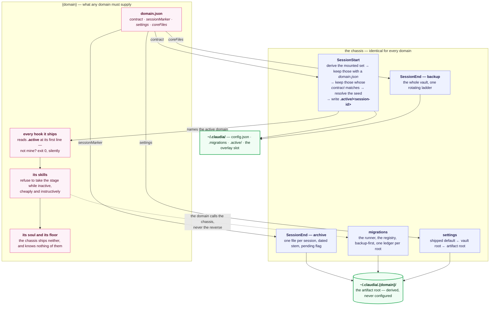
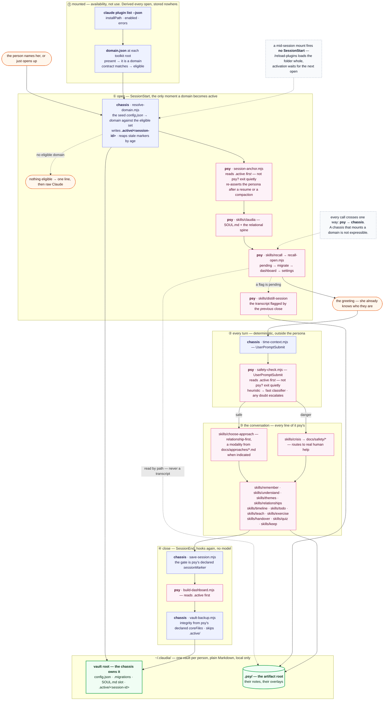

# Multi-domain spec — the handoff

Claudia becomes a near-empty **chassis** plus self-contained **domain** folders, `psy` first.
This document is the executable form of that decision: everything needed to perform the
migration, and nothing that still needs deciding.

It compresses eighteen resolved tickets. **Each decision lives in exactly one place — its
ticket.** This document gists and links; when a sentence here is not enough, open the ticket,
which carries the argument, the rejected options and the evidence.

| #                                                   | Ticket                                               | What it fixed                                              |
| --------------------------------------------------- | ---------------------------------------------------- | ---------------------------------------------------------- |
| [8](https://github.com/abernier/claudia/issues/8)   | Can a domain load from outside the plugin directory? | a domain is a plugin; the arrow runs domain → chassis only |
| [7](https://github.com/abernier/claudia/issues/7)   | Name the parts                                       | nine glossary entries                                      |
| [9](https://github.com/abernier/claudia/issues/9)   | How skills.sh ships a distributable unit             | prior art, not a delivery mechanism                        |
| [17](https://github.com/abernier/claudia/issues/17) | How much of the character may a domain bend          | the chassis ships no soul                                  |
| [11](https://github.com/abernier/claudia/issues/11) | Where the chassis stops and the domain starts        | the sorting rule; the seam cuts through six files          |
| [10](https://github.com/abernier/claudia/issues/10) | Where the person's domain artifacts live             | the two roots, the settings chain, two ledgers             |
| [20](https://github.com/abernier/claudia/issues/20) | Whether a domain mounts mid-session                  | a mount takes effect, an enablement does not               |
| [12](https://github.com/abernier/claudia/issues/12) | Who picks the active domain, and when                | active is a property of the session                        |
| [19](https://github.com/abernier/claudia/issues/19) | Vault-resident vs marketplace-installed              | marketplace-installed; the vault holds no shipped file     |
| [13](https://github.com/abernier/claudia/issues/13) | Where the safety floor lives                         | the cluster goes to psy whole, and self-gates              |
| [14](https://github.com/abernier/claudia/issues/14) | Moving an existing vault into a domain               | a second, shape-level migration series                     |
| [15](https://github.com/abernier/claudia/issues/15) | What a domain declares about itself                  | `domain.json`, four keys, an integer contract              |
| [18](https://github.com/abernier/claudia/issues/18) | What the chassis is called                           | `claudia` names the project; `claudia-chassis` the plugin  |
| [16](https://github.com/abernier/claudia/issues/16) | Installing a domain from a path or a URL             | no management surface; the switch is a setting             |
| [24](https://github.com/abernier/claudia/issues/24) | Where the per-session active marker lives            | `~/.claudia/.active/<session-id>`                          |
| [22](https://github.com/abernier/claudia/issues/22) | Where demo/ and evals/ land                          | the sort is whether it ships                               |
| [23](https://github.com/abernier/claudia/issues/23) | Where the test suite cuts                            | it does not cut                                            |
| [21](https://github.com/abernier/claudia/issues/21) | How the ADR series splits                            | one series, one place                                      |

The map is [Claudia as a multi-domain chassis](https://github.com/abernier/claudia/issues/6).

---

## I. The shape

### The two rules, in order

Every file in the repo sorts on two questions, asked in this order.

> **1. Does it ship?** `plugin install` copies a folder to a person. If the thing has no
> business in that copy, it is **project** and the sort stops there.

> **2. Must you have read the conversation to do this?** Yes → **domain**. No → **chassis**.
> Short form: _the chassis reads the label, never the note._

Rule 1 is the one that beats intuition. The demo rig seeds a fake psy vault and the e2e suite
asserts a greeting that names the fixture person — as psy as anything gets — and both stay at
the root, because the _repository_ contains psy while the _plugin_ is what gets copied.

Rule 2 cuts **through** six files rather than between them; that is the whole reason the
migration is not a `git mv`. See [§IV](#iv-the-seam-through-six-files).

### Three destinations

- **chassis** — the envelope. Session archive, settings resolution, migrations, backups. Ships
  as a plugin; contains no expertise and no character.
- **domain** (`psy`) — the unit of expertise. Soul, safety floor, skills, commands, hooks, and
  the docs a skill opens mid-conversation. Ships as a plugin.
- **project** — everything that ships nowhere: README, glossary, ADRs, tests, the demo rig, the
  e2e runner, release tooling.

### Target layout

```
/                            THE PROJECT — belongs to neither plugin
├── README.md                the project's front page
├── CONTEXT.md               one glossary, both vocabularies
├── package.json             private; npm workspaces; the chassis version line
├── .changeset/
├── docs/
│   ├── adr/                 one series, 33 + 8 new, never split
│   ├── ARCHITECTURE.md      one diagram, redrawn to show the seam
│   ├── research/            the three measured findings
│   └── multi-domain-spec.md this file
├── tests/                   all 17 files, unmoved
├── demo/                    the recording rig, psy fixture included
├── evals/e2e/               the assembled-system runner (npm run e2e)
└── .claude-plugin/
    └── marketplace.json     TWO entries

/chassis/                    THE CHASSIS PLUGIN — claudia-chassis
├── .claude-plugin/plugin.json
├── CHANGELOG.md · README.md
├── src/                     session · pending · backup · config
│                            frontmatter(identity) · migrations/ · time
├── scripts/                 resolve-domain · save-session · pending-sessions
│                            finish-distillation · vault-backup · vault-export
│                            migrate-vault · config · time-context
│                            install-backup-timer.sh
├── commands/                /backup /config /export /migrate /save
└── hooks/hooks.json         SessionStart · UserPromptSubmit · SessionEnd

/domains/psy/                THE PSY DOMAIN PLUGIN — psy
├── .claude-plugin/plugin.json
├── domain.json              the chassis contract
├── SOUL.md                  all 96 lines, floor included
├── CHANGELOG.md · README.md
├── skills/                  claudia · recall · crisis · distill-session … (18)
├── commands/                /dashboard /help-now /keep /menu /thread
│                            + the "a topic" branch of /forget
├── src/                     dashboard · anchor · frontmatter(judgment)
│                            the two content migrations
├── scripts/                 session-anchor · recall-open · build-dashboard
│                            safety-check
├── docs/                    approaches/ competencies/ qualities/ safety/
│                            bibliography.md · person-fiche-template.md
├── evals/                   the six quality cases
└── hooks/hooks.json         SessionStart · UserPromptSubmit · SessionEnd
```

Retired rather than sorted: `skills/author-skill/`, `agents/skill-auditor.md`,
`proposed-skills/`. Never once used; ADR-0006 is superseded.

### The vault

```
~/.claudia/                        one per person; plain Markdown; local only
├── config.json                    chassis — default ← vault root ← artifact root
├── .migrations                    chassis — the SHAPE series
│                                  first entry: 0001-flat-vault-to-psy
├── SOUL.md                        optional cross-domain overlay slot (the person's)
├── .active/<session-id>           chassis — one line: the active domain's name
└── .psy/                          THE ARTIFACT ROOT — derived, never configured
    ├── .migrations                the CONTENT series
    ├── config.json                optional settings overlay
    ├── SOUL.md                    optional per-domain overlay slot (the person's)
    ├── last-seen
    └── MEMORY.md · person.md · goals.md · safety.md · sessions/ · themes/ · people/ …
```

Rules that hold this together:

- **The vault holds no shipped file.** Not "the supported path happens to put them elsewhere" —
  a rule, including for a hand-rolled domain. The only copy of something irreplaceable must not
  sit in the one directory the backup ladder skips.
- **A root per owner**, and state lives in the root of the relationship it describes.
- **The artifact root is derived, never configured** — `~/.claudia/.<domain>/`, and the domain
  is spelled `.<domain>/` at the vault root and nowhere else.
- **The artifact root is flat**: a filename the toolkit root also ships is an _overlay_; every
  other filename is a note.

---

## II. The contract

### `domain.json`

At the toolkit root, beside `.claude-plugin/`. **Its existence is the domain marker** — a
domain is a plugin whose toolkit root carries a `domain.json`, echoing the mount rule it sits
next to. The chassis reads it _first_; a plugin without one is skipped before its
`plugin.json` is opened.

```json
{
  "contract": 1,
  "sessionMarker": "skills/claudia",
  "settings": {
    "dashboard": { "type": "boolean", "default": true },
    "language": { "type": "enum", "values": ["fr", "en"], "default": "fr" },
    "emoji": { "type": "boolean", "default": false },
    "verbose": { "type": "boolean", "default": false }
  },
  "coreFiles": ["MEMORY.md", "person.md", "safety.md"]
}
```

Bounded by one rule: **the chassis asks a domain for nothing it does not itself consume.**

| Key             | Sole consumer             | Answers                                               |
| --------------- | ------------------------- | ----------------------------------------------------- |
| `contract`      | `resolve-domain.mjs`      | am I able to talk to this domain?                     |
| `sessionMarker` | `chassis/src/session.mjs` | is this transcript ours, or a coding session?         |
| `settings`      | `chassis/src/config.mjs`  | which keys exist, and what values are legal?          |
| `coreFiles`     | `chassis/src/backup.mjs`  | has this vault lost something since the last archive? |

**Declared rather than discovered** for one reason, and it is not verifiability: all four are
read while the domain is **inactive, or absent from the session entirely**. Convention would
mean looking inside the domain's own files, which is the forbidden move.

**Deliberately absent:**

- **name and description** — `plugin.json`'s, never restated. A value in two files disagrees.
- **the artifact root** — derived, never declared.
- **anything safety-shaped** — the chassis declares, knows and verifies nothing about a
  domain's floor.
- **hooks, skills, commands, agents** — Claude Code discovers them from the folder.

### The contract integer

`contract` is an integer, not semver, for three reasons: there is no partial compatibility to
express; the plugin ships with no runtime dependency and a range parser is not worth
hand-rolling; and it decouples from the chassis's published version, which moves for reasons no
domain cares about.

Checked at `SessionStart`, where the manifest read already happens. **A domain whose `contract`
is not the chassis's current one is not eligible to be active** — not offered at the picker, and
the seed skips it. If that leaves nothing, the session degrades to _no active domain_.

**What counts as a breaking change** (i.e. when `contract` goes up):

1. any of the four keys — a rename, a removal, or a change of meaning;
2. the active marker's path or semantics — every domain hook reads it at its top;
3. the settings resolution chain, or the declared-key rule;
4. the two-roots rule, or how the artifact root is derived;
5. the ledger a domain's migrations write to, and the archive layout a restore produces.

Not breaking: a new chassis command, a new chassis-owned file at the vault root, or an added
`domain.json` key with a defaulted meaning.

> ⚠️ `plugin.json`'s `dependencies` does **not** enforce this. It resolves by name and ignores
> the range — see [§VII](#vii-measured-facts-about-claude-code). It is kept for what it
> demonstrably does (auto-install the chassis) and relied on for nothing else.

### The settings chain

```
shipped default  ←  ~/.claudia/config.json  ←  ~/.claudia/.<domain>/config.json
```

**A key is declared by whoever observes it.** Verified against the seam's own grep:
`saveTranscripts` → `save-session.mjs` and `backups` → `vault-backup.mjs` are chassis;
`dashboard`, `language`, `emoji`, `verbose` are psy. `domain` is the sixth chassis key and the
only one whose value set is open.

One clause makes a global language possible without breaking the declaring rule:

> **The vault-root file may carry a value for a key it does not declare.** The chassis
> preserves it and never interprets it; the domain that declares the key reads it through the
> chain and validates it there.

So one line at the vault root sets `language` for every domain, and the artifact root can still
override it for one.

### The two overlay slots

```
(the chassis ships nothing)
~/.claudia/SOUL.md              the person's overlay, across all domains
<toolkit root>/SOUL.md          the whole character, shipped by the domain
~/.claudia/.psy/SOUL.md         the person's overlay, psy only
```

Both person slots are **empty by default and not even created**, and are **additive**: an
overlay cannot delete the domain's floor. It can contradict it in prose — the domain's per-turn
hook is what actually holds the guarantee, and nothing person-written is load-bearing for
safety.

---

## III. The lifecycle

### Mount ≠ activate

Several domains may be mounted at once; **exactly one is active, per session**. Installing a
second domain never evicts the first. The domain boundary is a **session** boundary, because the
context window cannot be compartmentalised: a domain switched into a live conversation inherits
the other's half of it, and its `recall` would load continuity on top of material it has no
right to read. No archive design repairs that — the leak is in context, not on disk.

There is **no mid-session switch and no first-turn exception.** Switching rewrites the seed and
lands at the next `SessionStart` (`/clear` counts, and so do `resume` and `compact`).

### `SessionStart`, in order

1. **Derive the mounted set** — `claude plugin list --json` gives `installPath` and `enabled`
   for both mount paths. Nothing is stored. `enabled: false` counts as not mounted. If the call
   fails, resolve **no active domain**.
2. **Filter to domains** — `<installPath>/domain.json` present, and its `contract` matching.
3. **Resolve the seed** — `domain` in the vault-root `config.json`.
4. **Freeze** — write `~/.claudia/.active/<session-id>`, one line, the domain's name. Hooks read
   **the marker, never the seed**; re-reading the seed each turn would let a switch take effect
   mid-flight.
5. **Reap** — collect stale markers **by age, never by liveness**. A hook cannot know which
   sessions are open; an mtime older than a few days cannot touch a concurrent session.

| Seed                                                | Eligible domains | Result                                                   |
| --------------------------------------------------- | ---------------- | -------------------------------------------------------- |
| names an eligible domain                            | ≥ 1              | it is active. Silent. **The ordinary case.**             |
| absent                                              | exactly 1        | that one is active, **and the seed is written**. Silent. |
| absent                                              | 0 or ≥ 2         | **no active domain**                                     |
| names a domain not mounted, or failing the contract | any              | **no active domain**, seed left untouched                |

Two refusals are deliberate. With two domains and no seed the chassis does **not** pick —
alphabetical order is a coin toss with a straight face. With a stale seed it does **not** fall
back — silently seating someone with a different companion is worse than seating them with none,
and leaving the seed intact means reinstalling restores the status quo.

**The chassis's one utterance.** In the three no-active-domain rows, `SessionStart` emits
**exactly one line**, naming the eligible domains if any and pointing at `/config`. Zero lines
whenever a domain is active — which is every ordinary session. This does not breach the untinted
chassis: there is no persona loaded and no immersion to break.

### Self-gating

A plugin loads whole, and no plugin can silence another's hooks. So gating is **self**-gating:

> **Every domain hook reads `~/.claudia/.active/<session-id>` at its top and exits quietly when
> it does not name its own domain.**

This is the only mechanically enforceable lever besides _which artifact root receives_.
Everything else about exclusivity — an inactive domain's skills refusing to take the stage — is a
clause of this contract, carried by the domain's own skills. The chassis cannot stop the model
loading a mounted domain's skill: every mounted plugin's skills are discoverable, and an inactive
domain's descriptions still occupy context in every session. **The refusal must therefore be
cheap and instructive.**

### The switch

`/config` shows `domain` like any other key; its options are the eligible mounted domains,
labelled with the `description` from each `plugin.json`. Choosing one rewrites the seed. No new
command is created: **switching domains is changing a setting.** `/config` is a chassis command,
so it works when no domain is active — which is the one moment it is needed most.

The picker is `AskUserQuestion`, and this is the sanctioned ADR-0024 use rather than an
exception: a domain switch is a **decision**, not a question about how someone feels. The seed
chooses in silence; a _change_ is the person's act. The model never flips it alone.

### With no domain at all

The chassis alone is **raw Claude** in conversation, and a **custodian** on disk.

| Mechanism                        | With no domain       | Why                                                                       |
| -------------------------------- | -------------------- | ------------------------------------------------------------------------- |
| `vault-backup.mjs` · `/backup`   | works, degraded      | the vault still exists; the integrity alarm has no `coreFiles` to compare |
| `vault-export.mjs` · `/export`   | works                | exports files, does not read them                                         |
| `migrate-vault.mjs` · `/migrate` | works — **and must** | a shape migration is chassis upkeep; it has to run with no domain         |
| `/config`                        | works                | the recovery surface                                                      |
| `time-context.mjs`               | works                | indifferent to the domain                                                 |
| `save-session.mjs`               | no-op                | no `sessionMarker`, and no artifact root to receive                       |
| `/save`                          | inert                | it sets a flag nobody reads; distilling is a domain skill                 |

Two clauses to write, found while specifying and not in any ticket:

- **`/save` must refuse cleanly with no active domain**, rather than setting a flag that will
  never be consumed.
- **`/backup` must say that its integrity check is unavailable** with no domain, rather than
  passing silently — that is the moment right after an uninstall, when the check matters most.

### The picture — two of them, and they are not interchangeable

**The shape any domain follows.** This is the contract as a picture: what the chassis supplies,
what a domain must supply back, and the one rule every domain hook obeys. No filename here is
psy's — a `{nutrition}` domain fills the same slots with its own.



**The wiring as psy fills it.** This is the one `docs/ARCHITECTURE.md` gains in place of its
current diagram, at the migration — and **it has to stay concrete.** Its job is not to explain
the architecture; it is to be checkable against the code, and `structure.test.ts` reads it that
way: it extracts every `*.mjs` and every `skills/<name>` from the first mermaid block and asserts
each one exists, then asserts that every hook event and script wired in `hooks.json` is pictured.
A diagram drawn in `{domain}` slots names nothing, so the test's own guard —
_the diagram should name some of what it draws_ — fails, and the sync guarantee goes with it.

That guarantee was bought with a real failure: the ASCII picture this replaced still advertised a
`Stop` hook writing the summary long after `hooks.json` had moved to `SessionEnd`. **A generic
diagram cannot rot, because it says nothing that can become false — which is exactly why it
cannot replace this one.** Two pictures, two jobs: the one above says what a domain owes, the one
below says what this repo actually wires.

The only new name in it is `resolve-domain.mjs` — not `activate-domain`, since `activation`
belongs to Behavioral Activation.



---

## IV. The seam through six files

**This is the part that makes the migration not a `git mv`.** Six files are split; the rest move
whole.

| File                    | Stays chassis                                                                                      | Goes to psy                                                                               |
| ----------------------- | -------------------------------------------------------------------------------------------------- | ----------------------------------------------------------------------------------------- |
| `src/session.mjs`       | writing the transcript, one file per session, the `.pending-summary` flag                          | the gate marker (`CLAUDIA_ACTIVATION`, line 146) — becomes psy's declared `sessionMarker` |
| `src/frontmatter.mjs`   | the **identity** half — `type`, `session`, `dates`, `created`, `slug`                              | the **judgment** half — `people`, `themes`                                                |
| `src/config.mjs`        | the module, the declared-keys mechanism, closed value sets, shipped defaults, absent-means-default | **4 of 6 keys**: `dashboard`, `language`, `emoji`, `verbose`                              |
| `src/migrations/`       | the runner, the registry, the ledger mechanism, backup-first                                       | the two migrations themselves (`0001-wikilinks-to-relative`, `0002-vault-frontmatter`)    |
| `commands/forget.md`    | "a single session" and "everything" — both are paths and stems                                     | "a topic" — it reads `person.md` and `goals.md` — plus the register rules                 |
| `docs/memory-layout.md` | the envelope                                                                                       | the psy note kinds                                                                        |

`src/frontmatter.mjs` is the proof the seam is real rather than invented: the split was already
written into the file, in those words, for reasons that had nothing to do with domains.

Two files sort against their names and are worth stating so nobody re-litigates them:

- **`pending.mjs` is chassis** and is the cleanest case in the repo: `SESSION_FILE` matches
  `<stem>.(transcript.md|transcript.jsonl|summary.md|pending-summary)` and the module never
  opens a file. Pure envelope.
- **`finish-distillation.mjs` is chassis** despite its name: it stamps identity keys and clears
  the flag. The psy note kinds arrive as arguments.
- **`recall-open.mjs` is psy** and orchestrates three chassis mechanisms plus one psy one. That
  is the expected shape — the domain calls the chassis, never the reverse.

### `/forget everything` is re-scoped

> **`/forget everything` means the active domain's artifact root**, not the vault.

Two reasons. The marker is a live wire read on every turn, so erasing the whole vault would mute
the domain mid-conversation with nothing said — and an exception inside a destructive command is
a thing that gets dropped at the first refactor. And a command run inside a psy session that also
erases a `{nutrition}` vault the person never mentioned is exactly the compartmentalisation
breach the activation decision forbids.

**The disclosure must name what survives** — `config.json`, `.migrations`, the vault-root
`SOUL.md` slot, and any other domain's notes. Narrowing a promise made under the safety floor's
_real deletion_ rule, silently, would be worse than either option. `/forget` is a chassis command,
so the chassis can say "other domains hold notes, erase them from their own session" without psy
learning anything.

A person who wants every domain gone deletes `~/.claudia/`. The chassis needs no verb for it.

---

## V. Packaging and release

### Names

| Level                                      | Name              | Who sees it                                             |
| ------------------------------------------ | ----------------- | ------------------------------------------------------- |
| project — repo, marketplace, `~/.claudia/` | `claudia`         | the person, once, in a URL and a path                   |
| chassis plugin                             | `claudia-chassis` | nobody but `claude plugin list`                         |
| character                                  | **Claudia**       | the person, every sentence — shipped by psy's `SOUL.md` |

`claudia-chassis` and not `chassis`, because the skills-directory mount path is
`~/.claude/skills/<name>/` — a flat namespace where a collision silently overwrites.

**The `claudia@claudia` marketplace entry is retired**, not repurposed. If the chassis inherited
it, a routine `claude plugin update claudia@claudia` would succeed and leave the person with an
empty chassis — no character, no crisis skill, no floor — announced only by the chassis's one
technical line, which cannot point at the fix. Retiring makes the same command fail loudly
instead, and the README carries the one line an existing install needs.

Untouched by the rename: `skills/claudia/` keeps its name (so `/claudia` still works and the
`sessionMarker` string is byte-identical), `~/.claudia/`, `.psy/`, `domains/psy/`.

### Install

```
claude plugin marketplace add abernier/claudia
claude plugin install psy@claudia
✔ Successfully installed plugin: psy@claudia (+ 1 dependency: claudia-chassis)
```

**Nobody installs the chassis.** One command, both halves. `claude plugin marketplace add` takes
a path, a URL or an `owner/repo`; `claude plugin init` scaffolds a hand-rolled domain at
`~/.claude/skills/<name>/`.

### No management surface

**The chassis owns no packaging verb.** Add, list, remove, update, scaffold and release are
Claude Code's; the chassis learns about them only by reading `claude plugin list --json` once per
session. A wrapper dies three times over: the chassis is not a process at install time, a
mid-session install is unusable anyway, and validating a domain marker reports that a file
exists.

### Two version lines

`claude plugin tag` already cuts `{name}--v{version}`, so `claudia-chassis--v1.0.0` and
`psy--v1.0.0` coexist in one history with no scheme to invent. `marketplace.json` gains a second
entry and `tag` validates each against its own manifest.

The tooling is all **repo tooling** and ships nowhere:

- **npm workspaces**, `"workspaces": ["chassis", "domains/*"]`. The root `package.json` stays
  private; each unit gets one, so changesets has two packages to count.
- **`scripts/sync-version.mjs` becomes a loop** over (package.json → plugin.json → its
  marketplace entry).
- **Two `CHANGELOG.md`**, each beside its manifest. `changelog.mjs` takes a path.

A changeset now names which unit it bumps, and a change cutting through one of the six split
files **bumps both**. That is the seam telling the truth, not friction.

### Updating a domain

**Nothing triggers on a version, and there is no check to add.** `migrate-vault.mjs` walks the
registry, skips ids already in the ledger, applies the rest — it never reads a version. A toolkit
update that ships a new migration simply adds an id the ledger has not seen, and psy's `recall`
applies it at the next open.

A failure leaves the vault unchanged by construction: the transform is pure and computed before
any write, the backup precedes the apply, and the ledger records only what applied. One clause is
added — a failure is **disclosed, not silent**, and it is the **domain** that discloses it.

The downgrade is a one-way door, left open: a rolled-back domain finds ledger ids it has never
heard of, and the runner ignores them. **A domain's ledger is append-only; an unknown id is left
alone.**

Removal answers itself: uninstalling touches the cache or drops a link, and `~/.claudia/.psy/` is
somewhere else entirely. _Removing the toolkit must not remove the notes_ holds by construction.

---

## VI. The migration

### The shape series

A **second, chassis-owned migration series**, tree-level, because ADR-0020's registry is a
content transform with no deletion path and cannot express a move. One series per ledger.

`0001-flat-vault-to-psy`:

- **Triggered by the shape** — loose notes at the vault root. Never a version, never a date.
  That is what makes the downgrade round-trip self-healing.
- **Targets `psy`, hardcoded.** _The active domain_ was rejected as a silent catastrophe
  (a machine where the person opens `{nutrition}` first pours therapy notes into `.nutrition/`);
  _a domain declaration_ because it cannot run with no domain mounted, and **a shape migration
  is chassis upkeep that has to run with no domain at all**. A numbered migration is exactly
  where a historical fact belongs.
- **Runs before any content migration** — psy's take the artifact root as their root, and it
  does not exist until the shape migration has made it.
- **A pure plan of moves.** No content is read, none is rewritten; transcripts and assets ride
  along by path.
- **Atomic.** The whole tree moves or nothing does.

**What moves:** everything at the vault root **except** the three files the chassis owns there —
`config.json`, `.migrations`, and the `SOUL.md` slot. Stated as an exclusion list rather than
"everything moves", so a genuine cross-domain `SOUL.md` is never silently demoted to psy-only.

**The ledger splits**: today's `~/.claudia/.migrations` holds `0001-wikilinks-to-relative` and
`0002-vault-frontmatter`, which are psy's. It travels to `.psy/.migrations` **already-applied**,
so nothing replays, and a fresh chassis ledger is written at the root with the shape id as its
first line.

**`config.json` neither moves nor splits.** The resolution chain already lets the vault-root file
carry a value for a key it does not declare, so the four psy keys keep resolving from where they
sit. The migration touches no settings at all.

**Backups need one fix**, and it is a false alarm the move would otherwise have shipped:
`checkVault` compares `CORE_FILES` by path, so the first post-move archive would announce that
`MEMORY.md`, `person.md` and `safety.md` are gone. Fixed by a **baseline reset on a shape
migration**, plus making `CORE_FILES` a domain declaration.

**The disclosure** follows ADR-0020's quiet-apply-then-disclose, with one clause added: _an older
Claudia will no longer see these notes._ No prompt before — refusal is not on offer, so asking is
theatre.

### The one-way door

A new-shape vault opened by an older chassis finds nothing at the root, concludes _first meeting_,
and greets a months-long person as a stranger. Nothing downstream can defend that, so the return
is made **recoverable** instead: the shape trigger fires again and **refuses atomically** on the
first collision.

Backup and restore need no shape-awareness: restore unpacks _beside_ the vault and never over it,
and **the ledger travels inside the archive**, so every archive is self-describing. Pre-move
archives keep their shape forever and are never rewritten. The archive also freezes the **derived
inventory** — name, `id`, version, source, `installPath` per mounted domain — so a restore onto a
fresh machine knows which domains produced the notes.

### Order of execution

Three steps are irreversible or person-visible and belong in the ticket graph as blocking edges,
not as good sense:

1. **`0001-flat-vault-to-psy` runs against real vaults**, the maintainer's included. Archive
   first, by hand, before the first run.
2. **Retiring the `claudia@claudia` marketplace entry** comes _after_ `psy@claudia` and
   `claudia-chassis` are publishable, never before.
3. **The demo fixture is a flat vault** and will trip the shape trigger at the next seed. Either
   re-shape it at seed time or every take opens with a migration disclosure the scenario never
   mentions. The fixture also ships one `.migrations` and now needs two, both complete.

Also: `setup-home.sh` and `dev-link.sh` each link **two** folders instead of the repo root — and
the dev-link shadowing conflict becomes **per domain**, so `dev-link.sh` must uninstall a twin per
domain.

---

## VII. Measured facts about Claude Code

Behaviour, not contract. **Claude Code 2.1.220, macOS 27.0.0, 2026-07-26.** Re-run before relying
on any of it.

1. **`dependencies` resolves by name and ignores the range.** `chas@^9.0.0` installed `chas@0.13.0`
   and reported `+ 1 dependency: chas`. A dependency on a plugin that does not exist installs
   silently; the error surfaces only afterwards, as an `errors[]` entry in `plugin list --json`.
   `claude plugin uninstall` of a depended-on plugin succeeds with a warning.
2. **Auto-install works inside a marketplace, never across one.** A bare name is resolved as
   `<name>@<the declaring plugin's own marketplace>`: a domain in marketplace `B` declaring
   `["claudia-chassis"]` looks for `claudia-chassis@B` and reports it missing. The qualified forms
   `name@marketplace` and `name@marketplace@range` **address the right target and still do not
   install it**, even with that marketplace added. So `psy@claudia` is unaffected — both entries
   share the `claudia` marketplace, and the one-command install holds — but a **third-party domain
   published from its own marketplace cannot bring the chassis with it.** Its `dependencies` entry
   becomes documentation plus an `errors[]` line, and its install instructions are four commands,
   not one. This is the first place third-party distribution costs more than the in-repo case.
3. **An unknown field in `plugin.json` is tolerated at runtime and fails `claude plugin validate
--strict`** — documented for CI use. `keywords`, `displayName`, `homepage`, `repository`,
   `license` are recognized; `category` belongs in the marketplace entry.
4. **`userConfig` cannot express a closed value set.** Entries are
   `{type: "string"|"number"|"boolean"|"directory"|"file", title, description, default?, required?}`;
   `enum` is rejected. It is also stored per install, outside the vault — not backed up, not
   migrated, not exported.
5. **`plugin list --json` does not carry the description.** Read
   `<installPath>/.claude-plugin/plugin.json`. Cost measured at 0.39–0.41 s, once per session.
   `list --available --json` _does_ carry the marketplace entry's description.
6. **A mid-session mount takes effect on `/reload-plugins`; an enablement never does.** The flag is
   resolved at session start and cached, both ways. All four component types move together — no
   partial load.
7. **`SessionStart` never fires for a mid-session mount**, and **`/reload-plugins` does not exist
   outside the TUI** — so there is no programmatic reload, and for any non-interactive path
   mounting stays restart-level.
8. **No manifest field can point outside the plugin root.** `..` is rejected as traversal, absolute
   paths and `~` as invalid, and `${CLAUDE_PLUGIN_ROOT}` is taken literally — it is an _output_,
   never an input to the component scan.
9. **`claude plugin eval` targets a plugin** and reads `evals/**/case.yaml` relative to it, with
   `--ablation with-without` running a no-plugin baseline arm by default.

---

## VIII. ADR backlog

**One series, continuing at 0034.** The 33 existing ADRs do not move and do not renumber. `docs/`
splits on whether it is read at runtime: content a skill opens mid-conversation ships with the
domain; rationale a maintainer reads ships nowhere.

Frontmatter gains one line, asserted by `structure.test.ts`:

```yaml
---
status: accepted
applies-to: [psy] # chassis | psy | project — several allowed
---
```

| #    | Decision                                                                                               | `applies-to` |
| ---- | ------------------------------------------------------------------------------------------------------ | ------------ |
| 0034 | The chassis↔domain contract — `domain.json`, four declarations, the `contract` integer                 | chassis, psy |
| 0035 | Packaging and names — two plugins, `claudia-chassis`, `chassis/`, two version lines, the retired entry | project      |
| 0036 | The vault under two roots — derived artifact root, settings chain, two ledgers                         | chassis, psy |
| 0037 | The active domain — session-scoped, the seed, the picker in `/config`, `.active/<session-id>`          | chassis      |
| 0038 | The shape-migration series — `0001-flat-vault-to-psy`                                                  | chassis      |
| 0039 | The untinted chassis — the soul is the domain's, two overlay slots                                     | chassis, psy |
| 0040 | The floor is the domain's and self-gates                                                               | chassis, psy |
| 0041 | Self-authoring retired — **supersedes ADR-0006**                                                       | psy          |

### The 33, assigned

Someone has to write `applies-to` into 33 files. The judgements are made here so the migration
does not have to make them, and because the count is itself an argument.

| `applies-to`     | n      | ADRs                                                                                                                                                                                                                                                                                                                                                                                                                                    |
| ---------------- | ------ | --------------------------------------------------------------------------------------------------------------------------------------------------------------------------------------------------------------------------------------------------------------------------------------------------------------------------------------------------------------------------------------------------------------------------------------- |
| `[psy]`          | **19** | 0001 safety floor · 0002 knowledge architecture · 0006 self-authoring · 0008 working understanding · 0009 curiosity & intake · 0010 relationship map · 0011 person fiches · 0013 persona continuity · 0014 life timeline · 0015 the thread · 0018 to-do surface · 0019 dashboard · 0023 keepsakes · 0026 showing the deliverable · 0027 the menu · 0029 mirror language · 0030 consultation secrecy · 0031 verbose · 0033 handover note |
| `[chassis, psy]` | **8**  | 0003 runtime shape · 0004 memory model · 0007 stay local · 0012 time awareness · 0016 deferred distillation · 0024 the choice UI · 0025 frontmatter contract · 0028 settings                                                                                                                                                                                                                                                            |
| `[chassis]`      | **4**  | 0017 session identity · 0020 vault migrations · 0021 transcript images · 0032 vault backups                                                                                                                                                                                                                                                                                                                                             |
| `[project, psy]` | **1**  | 0005 language policy                                                                                                                                                                                                                                                                                                                                                                                                                    |
| `[project]`      | **1**  | 0022 types without transpilation                                                                                                                                                                                                                                                                                                                                                                                                        |

**Nine of thirty-three straddle the seam** — the eight above plus 0005. That is more than a
quarter of the series, and it is this ticket's strongest argument, which
[#21](https://github.com/abernier/claudia/issues/21) understated: it named only the three its
own body had listed (0004, 0025, 0028). ADR-0016 is the clearest of the nine, because its text
describes the seam before the seam had a name — _a verbatim archive written deterministically by
a hook, and a distilled working memory written by skills._ An ADR whose subject is the boundary
cannot be filed on one side of it.

The ratio is the second argument, and it is about honesty rather than counting. **Nineteen of
thirty-three are pure psy because for eight months the project _was_ psy.** ADR-0009 was not a
decision about the psy domain; it was a decision about Claudia, taken when no such distinction
existed. Filing it under `domains/psy/docs/adr/` would assert a categorisation its author never
made. `applies-to` records the sort as **an annotation added afterwards**, which is true, rather
than as a location, which would pretend it was always so.

One partial supersession the count surfaces: **ADR-0003 carries a clause that is now false** —
_single-plugin marketplace_ — overturned by [#18](https://github.com/abernier/claudia/issues/18).
ADR-0035 carries the supersession; the rest of 0003 stands.

**ADR-0001 is neither superseded nor edited.** Its content is unchanged and still holds wherever
psy is active; 0040 changed where the floor lives and when it speaks. It gains a forward pointer,
nothing more.

**An accepted ADR is never rewritten to match new vocabulary.** `CONTEXT.md` is rewritten in place
— a glossary's whole job is current vocabulary — and stays **one** file, because its entries hold
two things apart (chassis/domain, toolkit root/artifact root, mounted/active) and splitting them
would separate each distinction from itself. `docs/ARCHITECTURE.md` stays **one** diagram, because
showing the seam is its new job.

---

## IX. Tests, demo and evals

**The test suite does not cut.** All 17 files stay at the repo root: a test follows its module's
_import path_, not its module's destination, and tests ship nowhere.

**No fixture domain is needed.** Every place a chassis test would want one is exactly where this
spec replaced a hardcoded psy fact with an injected declaration — and `runMigrations({ root, dry,
migrations })` is already injectable today, for its own reasons. A test crosses a seam by calling
across it, not by building something on the far side.

**The one horn that survives:** a suite that always has psy on disk cannot prove by execution that
the chassis is free of it. So the claim is enforced statically —

> `structure.test.ts` gains an assertion that **no file under `chassis/` names a psy filename or
> path**: `goals.md`, `themes.md`, `people.md`, `timeline.md`, `keepsakes.md`, `todo.md`,
> `safety.md`, `SOUL.md`, `skills/claudia`, `.psy/`.

A grep, costing nothing, and the only mechanism in the repo that will notice the seam rotting.

`structure.test.ts` also gains: two manifests instead of one, the two-entry marketplace (its
current single-plugin `./` assertion **inverts**), `domain.json` present and schema-valid with a
matching `contract`, no therapy keyword in the chassis manifest, and every ADR declaring
`applies-to`.

`migrations.test.ts` now covers **two series** and gains the case that matters most in the
handoff: `0001-flat-vault-to-psy` against a flat fixture vault — the three chassis-owned root
files stay, the psy ledger arrives already-applied so nothing replays, and a second run is a
no-op.

**`demo/` and `evals/e2e/` stay at the repo root** as repo tooling. The rig is not split into a
generic engine plus a psy payload — you do not write a template engine for one client. `evals/e2e`
asserts the pipe _between_ the two plugins, and neither plugin can hold a test of the seam between
them.

**Only the six quality-eval cases move**, to `domains/psy/evals/`, because `claude plugin eval`
resolves them relative to a plugin. They are the one part that ships, and shipping them is right:
they are the closest thing to a specification a domain can carry. _Vault-free by design_ stops
being a house convention and becomes a shipping constraint.

**One CI**, at the root, exercising the assembly.

---

## X. Out of scope

- **A second domain.** Ruled out of scope rather than graduated: no fixture domain is required,
  and the two refinements the activation decision deferred — **one-shot arming** and **a
  first-turn window** — are decidable only once alternation exists. A fresh effort, not a
  resumption.
- **A public domain registry.** Discovery, publication, trust, signature. Only the local install
  path is in scope.
- **The landing site (`site/`).** Deferred, on its own terms.
- **Deleting the self-authoring files.** The _decision_ to retire is on the route and ADR-0041
  records it; the deletion is execution.

## XI. Known open ends

Not decisions — things this spec leaves for whoever executes:

- **The `composable-domains` branch** holds an earlier wayfinder effort on the same problem, with
  its own local-markdown tracker and at least one divergent conclusion (`/forget` removed there,
  kept and re-scoped here). Abandon or salvage — a map question, not a git one.
- **`/save` and `/backup` with no active domain** need the two clauses in [§III](#with-no-domain-at-all).
- **A mixed session** — dev work then a personal turn, in one context — has no model here. Today it
  resolves downward: psy is active everywhere, and the archive swallows the dev half. With a
  `{dev}` domain it would resolve upward, at the price of a deliberate `/clear`. Neither is
  specified.

### Found by building `{running}` on paper

The spec was read back as a second domain's author would read it — folder, manifest, contract,
soul, hooks, skills, artifact root, migrations, first session. Eight places do not answer.
**Seven are missing recipes for decisions already made; one is a missing decision.**

Blocking — a domain cannot be written without an answer:

1. **How a hook learns its own domain name.** Every domain hook reads `.active/<session-id>` on
   every turn and compares it to its own name, and nothing says where that name comes from: a
   hardcoded string, a read of `${CLAUDE_PLUGIN_ROOT}/.claude-plugin/plugin.json`, or the cache
   path's basename (fragile — it is `…/<name>/<version>/`). This is the most-executed line in the
   whole contract, so it is also a cost decision.
2. **How a skill refuses while inactive.** §III calls it contract rather than mechanism, but a
   skill is Markdown and cannot read a file. The options are prose instructing the model to
   check, or the domain's own `SessionStart` hook injecting _you are inactive_ into context — the
   only reliable one, and it is not mentioned. Without a recipe the clause is decorative.
3. **The migration registry across two plugins.** _(the missing decision)_ The chassis owns the
   runner and the registry; the domain owns the modules; `src/migrations/index.mjs` imports them
   by relative path. After the split they sit in another plugin's cache. A dynamic `import()` of
   an absolute path would work — the chassis has `installPath` — but nobody decided it, and it
   quietly reverses the direction of _code_ access relative to the packaging arrow.

Real, not blocking:

4. **The overlay rule has no mechanism.** _A filename the toolkit root also ships is an overlay,
   every other filename is a note_ requires comparing the artifact root's filenames against the
   toolkit root's. If the chassis does that comparison it must enumerate the domain's shipped
   files, which is close to reading the note.
5. **The current `contract` value is never stated as a rule** — `1` appears only in an example.
   A domain author needs _the chassis at version X ships contract N_ and somewhere to look it up.
   And the first bump makes every existing domain ineligible at once, silently: the contract has
   no migration story of its own.
6. **`sessionMarker` for a domain with no persona.** Optional or not? Absent probably means
   nothing is ever archived, which is likely right and is not written down.
7. **Who creates the artifact root, and when** — the chassis at first activation, or the domain
   at first write.
8. **`coreFiles: []`** must be legal for a new domain and must not trip the integrity alarm.

Two things were expected to break and hold: **settings keys collide safely** (each domain
declares and validates its own closed set, and one vault-root line feeds both), and **installing
a second domain does not disturb an existing seed**. And one accepted bet comes due: §IX refused
to split the demo rig because it had one client — a second domain is the second client.

- **`dependencies` semver on other platforms.** Measured on macOS only, one CLI version.
