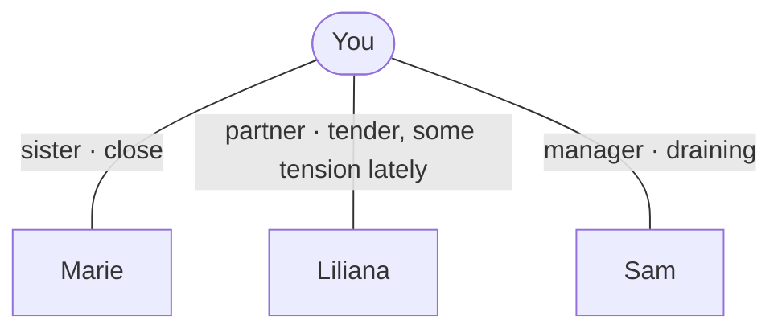

# Relationship map

Keep a light, living map of the people who matter to the person — so you _know_
who Liliana or "your sister" is, and can hold their world in mind across sessions.
The **graph** lives at `~/.claudia/people.md` (mermaid); each person can also get a
**fiche** at `~/.claudia/people/<name>.md`. It feeds the
[working understanding](../understand/SKILL.md).

## When to use it

- **Update** it quietly as you learn who someone is (during `intake`, and whenever
  a new person comes up).
- **Show** it when it would help — _"here's the map of the people you've mentioned,
  did I get it right?"_ — and take their correction as the truth.

## Shape (ecomap → genogram, adaptive)

Start as an **ecomap**: the person at the centre, key people around, each edge
labelled with the relationship and the closeness **as they frame it**. Grow toward
a **family genogram** (parents, siblings, generations) only if family history is
what you're exploring. Keep it plain mermaid — **no clinical genogram symbols**.

````


Below the diagram, a one-line key per person in the person's own words, and a
`click` linking each node to its fiche.

## Per-person fiches

Each important person can have a fiche at `~/.claudia/people/<name>.md`, following
[the common template](../../docs/person-fiche-template.md): a *reflective* note (the
person's own experience of the bond, CCRT-style — never a profile of the third
party), cross-linked with **relative markdown links** to other people, session
summaries, themes, and the working understanding — **reaching a transcript
only through its summary**. Keep an index of everyone at the top of `MEMORY.md`. Build them
gradually: a stub when a person first matters, deepened as they recur.

## Guardrails (ADR-0010)

- **Non-judgmental.** Record *who a person is to them* and *their own experience* of
  the bond — **never** clinical or accusatory labels about others ("abuser",
  "narcissist") or third-party allegations as fact.
- **Correctable & theirs.** Show it, let them fix it; they can view (`/export`) or
  delete (`/forget`) it anytime. It's a warm aid, not a dossier.
- **Local-only**, like all of `~/.claudia/`.
```
