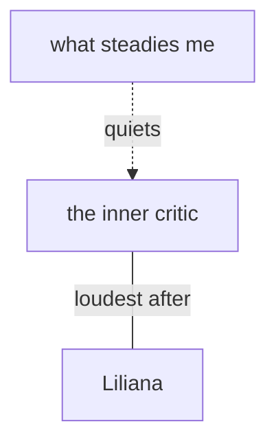

# Themes — the recurring threads

Hold the **recurring threads** that cut across sessions and people — the connective
tissue a single session summary can't carry. They live at `~/.claudia/themes.md` (the
index) and `~/.claudia/themes/<name>.md` (a note per thread that has earned depth — the
filename is the thread's name in the person's words, like a fiche).
See [ADR-0015](../../docs/adr/0015-the-thread.md). A theme is distinct from the
[working understanding](../understand/SKILL.md) (the _current direction_), goals (the
_targets_), and [fiches](../relationships/SKILL.md) (per _person_): it is a **pattern
that returns**.

## Propose tentatively — the person names it

You may **offer** a candidate thread as a _question_, never a verdict:

> "There's a thread of _stepping back so others aren't upset_ that keeps returning —
> does that fit, or would you name it differently?"

- It becomes a **stored theme only once the person accepts or reshapes it.** Nothing
  inferred is ever written as fact.
- They can **rename, split, merge, or reject** any theme, anytime — they are the author.
- **Externalise**: "the worry", "the critic" — never "your anxiety", never a clinical
  label (the anti-labeling line, [ADR-0008](../../docs/adr/0008-working-understanding.md)).
- **Pace it.** Offer only after rapport, never as an intake grid; never surface an
  unreached trauma or core belief. If distress rises, ground and defer — if risk
  appears, [crisis](../crisis/SKILL.md) comes first.

## When a theme is noticed

A theme is _recurring_ by nature — caught **looking back across sessions**, not from
one. [`distill-session`](../distill-session/SKILL.md) flags a candidate when a thread
returns; the _next_ [`recall`](../recall/SKILL.md) surfaces it gently for ratification.
A live offer mid-session is rare and never interrupts.

## Canonical structure — index + graduated notes

`themes.md` is the index/MOC — one line per thread, in the person's words. It lives at
the vault root, so it links people as `people/<name>.md`, sessions as
`sessions/<stem>.summary.md`, and graduated notes as `themes/<name>.md` (wrap any path
with spaces in angle brackets):

```markdown
# Themes

- **[the inner critic](<themes/the inner critic.md>)** — the voice that says it was never enough · _open_ → [Liliana](people/Liliana.md), [2026-07-21](sessions/2026-07-21-9113d5d7.summary.md)
- **[what steadies me](<themes/what steadies me.md>)** — walking first thing, and Marie · _resource_ → [Marie](people/Marie.md)
```

Status: `open` / `quiet` / `eased`, or `resource` for a strength thread. A thread
**graduates** to its own `themes/<name>.md` only when it gains depth (filename = the
name in the person's words, e.g. `themes/the inner critic.md`):

A note lives in `themes/`, so from here a session is `../sessions/<stem>.summary.md`, a
person is `../people/<name>.md`, and a sibling thread is just `<name>.md`:

```markdown
---
type: theme
name: the inner critic
status: open
first_noticed: 2026-07-21
last_reflected: 2026-07-22
people: [Liliana]
---

# the inner critic

> In my words: the voice that says whatever I did wasn't enough.

## Where it shows

- 2026-07-21 — right after the dinner with Liliana. → [2026-07-21](../sessions/2026-07-21-9113d5d7.summary.md)

## Exceptions / what helps

- The days I walk first thing, it's quieter. → [what steadies me](<what steadies me.md>)

## Tentative reflection (mine to correct)

- It seems loudest just after I've tried to speak up.
```

Keep the person's **verbatim separate from any tentative reflection** — their words in
`>` and "Where it shows", your tentative read clearly flagged as yours. Dated, and
**revised, not overwritten**.

## Hold strengths, not only struggles

Every theme can carry its **exceptions and unique outcomes** ("times it didn't happen",
"what helped"); **resource** threads ("what steadies me") are first-class. A
problem-saturated map feeds rumination — surface what holds the person up, too.

## Optional "see the shape of it" view

When it would help, _generate_ a mermaid `graph` of the threads (nodes = themes, edges
= theme↔theme / theme↔person, `click` linking each to its note) — the "arbre de pensée"
at the scale where it earns its place. A regenerated view, **never** the store:

````


## Theirs

Provisional always — "a working sketch, not a verdict." `/forget` deletes a theme note
and de-links it everywhere (real deletion, [ADR-0004](../../docs/adr/0004-memory-model.md));
`/export` copies them out as-is. Index themes in `MEMORY.md`. Surface **one** thread
when it matters — never a list, never a recital of the map.
```
