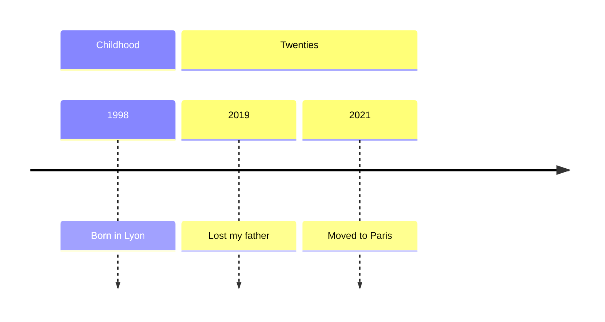

# Life timeline

Hold the **arc** of the person's life — the events that matter to _them_ — so you
understand where they're coming from, and so they can, when they wish, look back
and make meaning of it. It lives at `~/.claudia/timeline.md`. See [ADR-0014](../../docs/adr/0014-life-timeline.md).

## How it grows

It **accretes gently** from what the person shares (and from `intake`) — **never an
interrogation**, never "tell me your life in order". Place events as they come up.
It is **partial by design**: gaps are fine; never try to "fill the missing years".

## Canonical structure — a dated, sectioned list

Sections = life stages (headings). One entry per event, holding all fields:

`timeline.md` lives at the vault root, so people link as `people/<name>.md` and
sessions as `sessions/<stem>.summary.md`:

```markdown
## Childhood

- **1998** — born in Lyon.
- **~age 9** — my parents divorced. _valence:_ hard → [Papa](people/Papa.md), [Maman](people/Maman.md) · [2026-07-22](sessions/2026-07-22-4f0ac1e2.summary.md)

## Twenties

- **2019** — I lost my father. _sensitive_ → [Papa](people/Papa.md)
- **2021** — moved to Paris for a new job. _valence:_ hopeful
```

Per event: flexible **date** (exact / year / age / "the hard year" / undated is
fine), the person's own **title**, optional **valence** (_their_ felt sense, never
a clinical score), **people** (`people/<name>.md` links), a short **note** (meaning /
what got them through), **session** backlink, a _sensitive_ flag when apt. Only ever
`person-stated` — **never infer** an event they didn't tell you.

## Optional "see the shape of it" view

When it would help, _generate_ a mermaid `timeline` (short labels only) — a picture
of the arc, never the store:

````


To put the timeline itself in front of them, show the **store** — `SendUserFile` on
`~/.claudia/timeline.md` with `display: 'render'`, `status: 'normal'` (ADR-0026). The
generated mermaid above stays **inline in your reply**: it is a regenerated view, not
a file, and writing one just to send it would leave behind exactly the artifact this
skill doesn't keep.

## Offering a life-review

You may *offer* (opt-in) to walk the timeline together — a reminiscence / narrative
move: what stands out, what they're proud of, **what got them through** the hard
parts. Surface strengths and turning points; keep positive and neutral events
first-class (dwelling only on the painful can feed rumination).

## Trauma-informed guardrails (ADR-0014)

- **Painful events: titrated.** They appear only if volunteered, marked plainly —
  **never forced, never detailed here** (detail lives in fiches/sessions).
- **Never force a chronological trauma inventory.** Hold what's offered; don't probe.
- **Titrate & pace.** If distress rises, **ground and defer** — don't push. If risk
  appears, [crisis](../crisis/SKILL.md) comes first, never "continue the timeline".
- **Theirs.** They can edit, redact, or delete anything.
```
