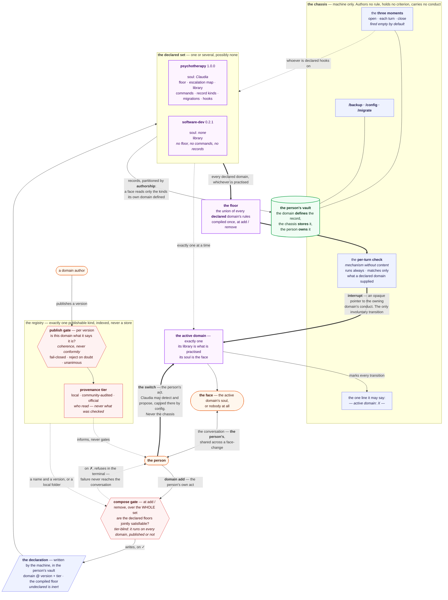

# The composition diagram — the chassis and its domains

Asset of [The composition diagram](../tickets/010-composition-diagram.md). Draws **one
authority — the domain** — over a chassis that authors nothing, with the registry and its
two gates at the edges.

The domain dimension reads generically: _one or several_. Psychotherapy and software-dev
are the drawn instance, not the model.

## How to read it

**The purple layer is the only authority.** Knowledge, floor, commands, record kinds,
migrations _and_ character all hang off the domain. The blue layer authors nothing: it
fires moments, runs a check with no criteria of its own, keeps three commands that never
open a note, and says one line.

**Two clocks, two arrow weights.** The thick arrow from the whole declared set to the
floor is the **declaration** clock — the floor gathers from every declared domain, whichever
one is being practised, because _a prohibition that only binds the practice that authored
it is not a prohibition_. The dotted arrow to the active domain is the **practice** clock —
exactly one, a property of the conversation and not of the declaration.

**One edge is missing on purpose.** There is an arrow from the floor into the active
practice and **none the other way**: a floor may cut a practice, a practice may never
soften a floor.

**The switch comes from the person and from nowhere else.** Claudia may detect and propose;
the chassis never moves it. The only transition the person did not ask for is the floor
interrupt.

**The face follows the active domain; the records follow the declared set.** A switch moves
the face and moves nothing on disk — psychotherapy's commands and notes stay reachable
while software-dev is practised, because consulting one's notes is not practising.

**Claudia ⊕ {} is this same picture with the purple gone**: the moments fire and nothing
happens, the check runs and matches nothing, the three commands remain, and nobody speaks.
