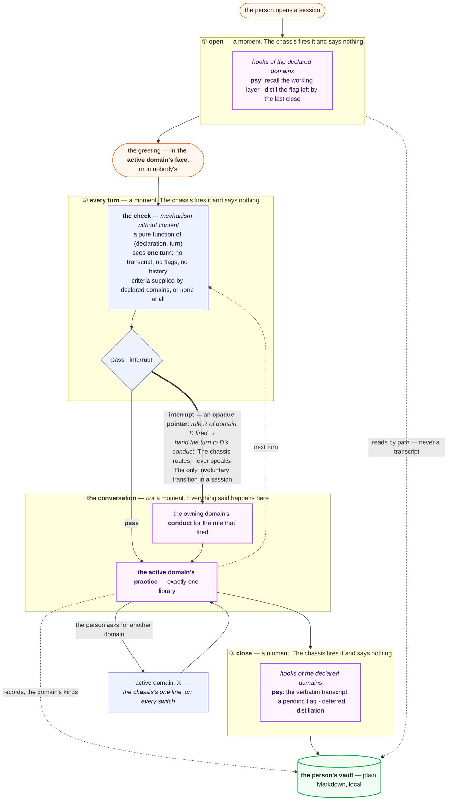

# The lifecycle diagram — the invariant session

Asset of [The lifecycle diagram](../tickets/011-lifecycle-diagram.md). The generalization
of the shipped picture in [`docs/ARCHITECTURE.md`](../../docs/ARCHITECTURE.md).

**What is invariant is the topology of moments, not the content.** The chassis fires three
moments — open, each turn, close — and whoever is declared hooks onto them. Change the
domain set and every node's _filling_ changes; not one edge moves.

## Who owns what

Two layers, not three. There is no persona layer: the greeting's voice is a property of
whichever domain is active.

|                         | owns                                                                                                                  |
| ----------------------- | --------------------------------------------------------------------------------------------------------------------- |
| **the chassis** (blue)  | the three moments, the check _mechanism_, the routing of an interrupt, and one line of text: _which domain is active_ |
| **the domain** (purple) | everything that is said, everything that is read, everything that is written                                          |

## The five things the drawing must not lose

1. **The check sits before anything answers, and outside it.** It reads the person's
   message; nothing ever reads the response. Output-side verification was refused —
   corrective, never preventive, and worthless on the rule that needs prevention most.
2. **Two verdicts, and it never speaks.** It does not block the turn, does not address the
   person, and carries an **opaque pointer** rather than conduct text. That opacity is what
   evicts the psy conduct string currently hardcoded in chassis code.
3. **The interrupt is the only involuntary transition.** The switch is the person's act;
   the interrupt is the floor's. Nothing else moves without being asked.
4. **Present and idle is not absent.** Under Claudia ⊕ {} the check still runs — it matches
   nothing, because the chassis holds no criteria. _Silent, not permissive._ The same shape
   holds at every station: the moments fire and nothing happens.
5. **The seam is the machine's.** A face never narrates its own exit, and the marker reads
   the same whether a face follows it or not.

## The same topology under four compositions

Nothing in the diagram changes across these rows. Only the fillings do.

| composition               | ① open                 | ② each turn                          | the conversation                          | ③ close                        |
| ------------------------- | ---------------------- | ------------------------------------ | ----------------------------------------- | ------------------------------ |
| **⊕ {psy}**               | recall + distillation  | psy's criteria live                  | Claudia's face, psy's library             | transcript, flag, distillation |
| **⊕ {psy, software-dev}** | psy's hooks            | the **union** of both floors, always | one face at a time, one library at a time | psy's hooks                    |
| **⊕ {software-dev}**      | nothing                | its floor, if it declares one        | no face; its library                      | nothing                        |
| **⊕ {}**                  | fires, nothing happens | runs, matches nothing                | nobody speaks                             | fires, nothing happens         |

The last row is the invariant proving itself: every edge still fires, and the session is
a machine with three commands, and Claude.
